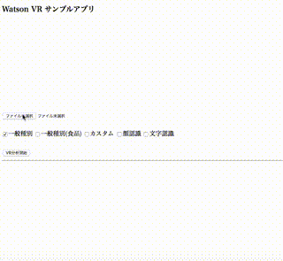
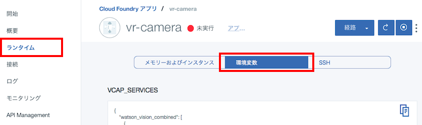
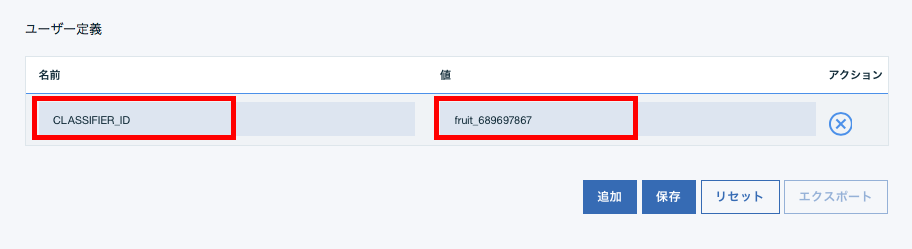
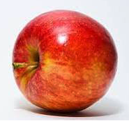
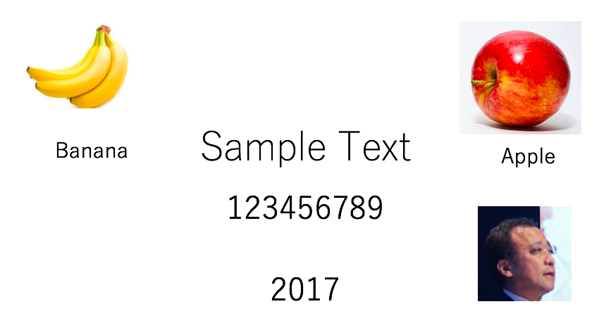

# Visual Recognition サンプルアプリ 

このアプリケーションはWatsonの画像認識APIである、Visual Recognitionの機能を簡単に確認するものです。  
次の特徴を持っています。  

* 日本語対応
* スマホから撮った写真をすぐに解析可能  
ブラウザのアプリケーションですが、iPhone/iPadの場合、Safariを使うことでカメラの利用が可能です。
* 複数の機能を同時に呼出し可能  
一つのイメージに対して以下の機能を同時に呼び出すことが可能です。  
どの機能を呼び出すかは、画面のチェックボックスで指定します。

対応している機能  

* 一般種別分類 (分類器名=default)
* 食品種別分類 (分類器名=food)
* カスタム分類
* 顔認識
* 文字認識

デモ画面  


※ 個別機能のうち、文字認識は開発版、食品種別分類はベータ版です。  
将来の製品化を保証するものでない点をご了解ください。


# 導入手順

## Bluemixアカウントの準備

[Bluemixアカウントを作る][sign_up] か、あるいは既存のBluemixアカウントを利用します。

## 前提ソフトの導入
次の前提ソフトを導入します。下記のリンク先からダウンロード後、それぞれ導入して下さい。

[gitコマンドラインツール][git]  
[Cloud Foundryコマンドラインツール][cloud_foundry]  
  
注意: Cloud Foundaryのバージョンは最新として下さい。 

## ソースのダウンロード
Githubからアプリケーションのソースをダウンロードします。  
カレントディレクトリのサブディレクトリにソースはダウンロードされるので、あらかじめ適当なサブディレクトリを作り、そこにcdしてから下記のコマンドを実行します。  
ダウンロード後、できたサブディレクトリにcdします。
 

```
$ cd (適当なサブディレクトリ)
$ git clone https://git.ng.bluemix.net/akaishi/vr-camera.git
$ cd vr-camera
```

## CFコマンドでログイン
CFコマンドでbluemix環境にログインします。ログイン名、パスワードはBluemixアカウント登録で登録したものを利用します。  
ログインに成功すると、次のような画面となります。  

```
$ cf login
```

  


## CFコマンドの実行
次のような一連のCFコマンドを実行します。
\<service_name\>はなんでもいいのですが、インターネット上のURLの一部となるので、ユニークな名前を指定します。
(例) vr-camera-aka1


```
$ cf create-service watson_vision_combined free visual-recognition-1
$ cf create-service-key visual-recognition-1 myKey
$ cf push <service_name>
```

デプロイには数分時間がかかりますが、正常に終了すれば、Watson VRアプリケーションの完成です。

## アプリケーションの実行

URLは、

```
https://<service_name>.mybluemix.com
```

です。iPhone/iPadからも使えますので、いろいろな写真をWatsonがどう認識するか、試してみて下さい。

## 応用編1　カスタム分類器の利用
このアプリケーションでは、自分でカスタム学習させた分類器も利用可能です。(１分類器のみ)
そのための手順は以下となります。

カスタム分類器を利用する場合は、環境変数の値をCloudFoundary管理画面から、「ランタイム」「環境変数」を選択して下記のようにCLASSIFIER_IDの値を設定します。  
  
  
  
  
  
環境変数を保存すると自動的に再構成が動き出します。  
しばらくしてこれが完了したら、利用可能な状態です。

## 応用編2 アプリケーションの修正
Bluemixで稼働しているNode.jsアプリケーションのソースは git cloneコマンドでダウンロードしたローカルファイルです。このソースを修正して、再度 "cf push \<service_name\>"コマンドを実行すると、Bluemix上のアプリケーションにも修正が反映されます。  
自分でアプリケーションコードを開発したい場合は、このサンプルソースを雛形に試してみると、効率よくアプリケーション開発ができます。

## (参考)サンプルイメージ
sample_images配下にテスト用のサンプルイメージが入っていて、動作確認に利用可能です。

     

[cloud_foundry]: https://github.com/cloudfoundry/cli#downloads
[git]: https://git-scm.com/downloads
[sign_up]: https://bluemix.net/registration
[local_url]: http://localhost:6010
[bluemix_dashboard]: https://console.bluemix.net/dashboard/


