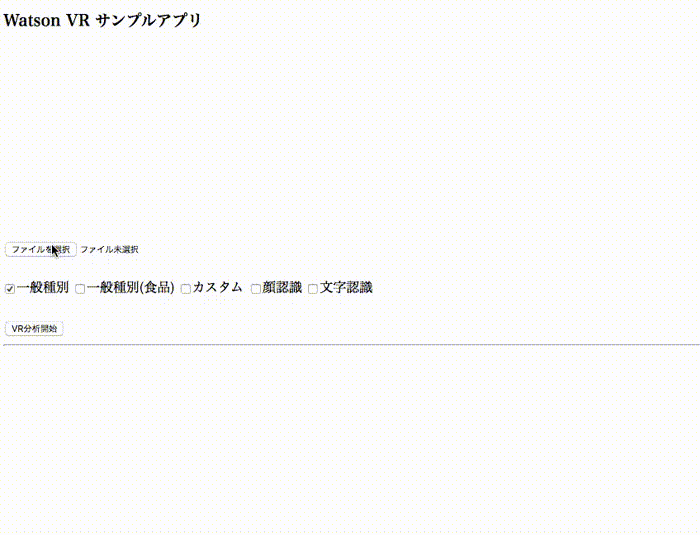

# Visual Recognition サンプルアプリ 

このアプリケーションはVisual Recognitionの機能を簡単に確認するためのサンプルアプリケーションです。  
次の特徴を持っています。

* 日本語対応
* スマホから撮った写真をすぐに解析可能  
ブラウザのアプリケーションですが、iPhone/iPadの場合、Safariを使うことでカメラの利用が可能です。
* 複数の機能を同時に呼出し可能  
一つのイメージに対して以下の機能を同時に呼び出すことが可能です。  
どの機能を呼び出すかは、画面のチェックボックスで指定します。

対応している機能  

* 一般種別 (分類器名=default)
* 一般種別 (分類器名=food)
* カスタム分類器
* 顔認識
* 文字認識

デモ画面  



## 事前準備

### Bluemixアカウントの準備
   [Bluemixアカウントを作る][sign_up] か、あるいは既存のBluemixアカウントを利用します。
 
### 前提ソフトの導入
 次の前提ソフトを導入します。Node.jsはローカルで動かす場合に必要となります。 
   
  [gitコマンドラインツール][git]   
  [Cloud Foundryコマンドラインツール][cloud_foundry]  
  [Node.js][node_js] 

  注意: Cloud Foundaryのバージョンは最新として下さい。

### ソースのダウンロード
カレントディレクトリのサブディレクトリにソースはダウンロードされるので、あらかじめ適当なサブディレクトリを作り、そこにcdしておきます。

```
git clone https://git.ng.bluemix.net/akaishi/vr-camera.git
```
### Visual Recognitionサービスの作成
Bluemixにログインし、サービスの中からVisual Recognitionを選んで作成します。  
  
  
  
サービス名は任意(デフォルトで可)、プランはデフォルトの無料のものを選択します。  
  
  
  
### API Keyの確認
作成したVisual Recognitionのサービスで、API Keyの確認を行います。  

ダッシュボードで作成したVisual Recognitionのサービスを選択します。  
VRの管理画面から「サービス資格情報」を選択し、更に画面右の「資格情報の表示」をクリックします。  
表示されたJSON形式のデータから、api_keyの値をコピーし、テキストエディタなどに貼り付けて保存します。(下図)  

  
  
カスタム学習器による分類結果も表示したい場合は、カスタム分類器のclassifier_idも事前に調べておきます。  
  
## ローカル環境へのデプロイ

### プログラムの導入

次のコマンドを実行して必要なモジュールを導入します。

```
cd vr-camera
npm install
```

### 環境変数の設定

カレントディレクトリにあるexample.envをテキストエディタで開いて、API\_KEYの値を設定します。  
カスタム分類器を使いたい場合は、CLASSIFIER\_IDの指定も行います。  
カスタム分類器を使わない場合は、CLASSIFIER\_IDをコメントアウトのままにして下さい。

```          
API_KEY=xxxxxxxxxxxxxxxxxxxxxxxxxxxxxxxxxxxxxxxx
CLASSIFIER_ID=xxxxx_xxxxxxxxx
```    
      
設定が完了したら、次のコマンドで結果を .envにコピーしたのち、ローカルでnode.jsを起動します。
  
```
cp example.env .env
npm start
```

正常にNode.jsが起動できていれば、ブラウザから [http://localhost:6012][local_url] のURLでアプリケーションを起動できます。


## Bluemix環境へのデプロイ

### プログラムの配布

cf loginコマンドではemailとpasswordを聞かれるのでbluemix登録時のemailアドレスとパスワードを指定します。   
cf pushコマンドで指定する \<your\_appl\_name\> はBluemix上のインスタンス名であると同時に、インターネット上のURL名にもなるので、ユニークなものを指定します。  

```
cd vr-camera
cf login
cf push <your_appl_name>
```
  
### 環境変数のセット
前の手順でローカル環境でNode.jsを動かしている場合、cf pushコマンドで.envファイルのコピーも行われるので、以下の手順は必要ありません。  
以下の手順はローカルでのテストを省いてBluemix上で動かす場合、または継続的開発環境の設定をBluemix上で行いGitHub上のソースをBluemix環境に直接デプロイする場合に必要となります。 
  
環境変数の値をCloudFoundary管理画面から、「ランタイム」「環境変数」を選択して設定します。  
  
  
  
　
　  
  
  
### アプリケーションのURLと起動
環境変数を保存すると自動的に再構成が動き出します。  
しばらくしてこれが完了したら、下記の画面で該当するCloud Foundaryアプリケーションの「経路」のリンクをクリックするとアプリケーションが起動されます。  

  

## (参考)サンプルイメージ
sample_images配下にテスト用のサンプルイメージが入っていて、動作確認に利用可能です。

  
  
 


[node_js]: https://nodejs.org/#download
[cloud_foundry]: https://github.com/cloudfoundry/cli#downloads
[git]: https://git-scm.com/downloads
[sign_up]: https://bluemix.net/registration
[local_url]: http://localhost:6012

