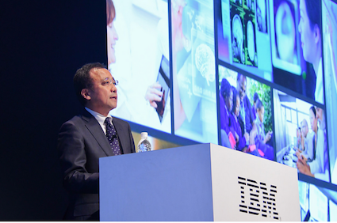
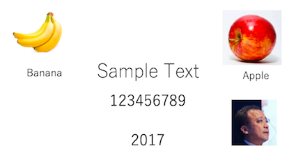

# Visual Recognition サンプルアプリ 

このアプリケーションはVisual Recognitionの機能を簡単に確認するためのサンプルアプリケーションです。  
次の特徴を持っています。

* 日本語対応
* スマホから撮った写真をすぐに解析可能  
ブラウザのアプリケーションですが、iPhone/iPadの場合、Safariを使うことでカメラの利用が可能です。
* 複数の機能を同時に呼出し可能  
一つのイメージに対して以下の機能を同時に呼び出すことが可能です。  
どの機能を呼び出すかは、画面のチェックボックスで指定します。

対応している機能  

* 一般種別分類 (分類器名=default)
* 食品種別分類 (分類器名=food)
* カスタム分類
* 顔認識
* 文字認識

デモ画面  


※ 個別機能のうち、文字認識は開発版、食品種別分類はベータ版です。  
将来の製品化を保証するものでない点をご理解下さい。


# Bluemix環境への自動導入
最も簡単にBluemix上にデモ環境を作りたい場合は、「自動導入」をお勧めします。  
その場合、以下の手順に従って下さい。 

## 事前準備
Bluemixアカウントを持っていない場合は [Bluemixアカウントを作る][sign_up] に従い、Bluemixアカウントを作成します。  
Bluemixアカウントを使って、 [Bluemixダッシュボード][bluemix_dashboard] を表示させて下さい。

## サービス・インスタンスの自動生成
  
- 次のボタンを押して下さい。

&nbsp;&nbsp;&nbsp;&nbsp;&nbsp;&nbsp;&nbsp;&nbsp;&nbsp;&nbsp;&nbsp;&nbsp; [](https://bluemix.net/deploy?repository=https://git.ng.bluemix.net/akaishi/vr-camera)


- 下の画面が表示されたら「アプリ名」をわかりやすいものに変更し(アプリケーションのURLの一部になります) 、「デプロイ」ボタンをおします。

&nbsp;&nbsp;&nbsp;&nbsp;&nbsp;&nbsp;&nbsp;&nbsp;&nbsp;&nbsp;&nbsp;&nbsp;


* このボタンを押すことにより次の処理が自動的に行われます。
  - CloudFoundaryアプリケーションの作成
  - Watson APIサービスのVisual Recognitionインスタンスの作成
  - Visual RecognitionインスタンスとCloudFoundryアプリケーションのバインド
- 次の画面が表示されたら一番右の「Delivery Pipeline」を選択します。

&nbsp;&nbsp;&nbsp;&nbsp;&nbsp;&nbsp;&nbsp;&nbsp;&nbsp;&nbsp;&nbsp;&nbsp;

- 下図のようにBuild StageとDeploy Stageの両方が「成功」となればアプリケーションのビルドは成功です。

&nbsp;&nbsp;&nbsp;&nbsp;&nbsp;&nbsp;&nbsp;&nbsp;&nbsp;&nbsp;&nbsp;&nbsp;

- 下の画面からダッシュボードの画面を表示します。

&nbsp;&nbsp;&nbsp;&nbsp;&nbsp;&nbsp;&nbsp;&nbsp;&nbsp;&nbsp;&nbsp;&nbsp;

- 赤枠で囲んだアプリケーションのリンクをクリックして、アプリケーションを起動します。  
※　Visual Recognitionのインスタンスを作成してからAPIキーが有効になるまで数分かかるので、アプリケーション作成直後はエラーになります。5分程度待ってからアプリケーションを起動するようにして下さい。

&nbsp;&nbsp;&nbsp;&nbsp;&nbsp;&nbsp;&nbsp;&nbsp;&nbsp;&nbsp;&nbsp;&nbsp;

## カスタム分類器の利用
カスタム分類器を利用するためには、追加で以下の手順が必要となります。
事前にカスタム分類器のCLASSIFIER_IDを調べておいて下さい。

### VRサービスの再バインド
新規に作成したVRサービスでなく、事前に作成したVRサービスを利用する場合は、VRサービスのアンバインド・再バインドを行い、利用したいVRサービスを接続対象に変更します。  

### 環境変数の設定
アプリケーションの管理画面から「ランタイム」「環境変数」をクリックし、画面を下にスクロールして"CLASSIFIRE\_ID"とその値を設定します。

&nbsp;&nbsp;&nbsp;&nbsp;&nbsp;&nbsp;&nbsp;&nbsp;&nbsp;&nbsp;&nbsp;&nbsp;


# Bluemixへの手動導入(以下工事中)
より細かくBluemixの挙動を知りたい場合は、以下の「手動導入」の手順をお勧めします。  
「手動導入」には導入先により「ローカルへの導入」と「Bluemixへの導入」があります。  
「事前準備」はどちらの導入先を選ぶ場合も共通に必要な手順です。  

## 事前準備

### Bluemixアカウントの準備

[Bluemixアカウントを作る][sign_up] か、あるいは既存のBluemixアカウントを利用します。
### 前提ソフトの導入
次の前提ソフトを導入します。Node.jsはローカルでサーバーを動かす場合に必要となります。 

[gitコマンドラインツール][git]  
[Cloud Foundryコマンドラインツール][cloud_foundry]  
[Node.js][node_js] 
  
注意: Cloud Foundaryのバージョンは最新として下さい。 


### ソースのダウンロード
カレントディレクトリのサブディレクトリにソースはダウンロードされるので、あらかじめ適当なサブディレクトリを作り、そこにcdしておきます。
  

```
git clone https://git.ng.bluemix.net/akaishi/vr-camera.git
```

### Visual Recognitionサービスの作成
Bluemixにログインし、サービスの中からVisual Recognitionを選んで作成します。  
  
  
  
サービス名は任意(デフォルトで可)、プランはデフォルトの無料のものを選択します。  
  
  
  
### API Keyの確認
作成したVisual Recognitionのサービスで、API Keyの確認を行います。  

ダッシュボードで作成したVisual Recognitionのサービスを選択します。  
VRの管理画面から「サービス資格情報」を選択し、更に画面右の「資格情報の表示」をクリックします。  
表示されたJSON形式のデータから、api_keyの値をコピーし、テキストエディタなどに貼り付けて保存します。(下図)  

  
  
カスタム学習器による分類結果も表示したい場合は、カスタム分類器のclassifier_idも事前に調べておきます。  
  
## ローカル環境へのデプロイ
### プログラムの導入
次のコマンドを実行して必要なモジュールを導入します。
  
```
cd vr-camera
npm install
```
  
### 環境変数の設定

カレントディレクトリにあるlocal.env.sampleをlocal.envにコピーします。  
  
```
cp local.env.sample local.env
```
  
テキストエディタでlocal.env開いて、API\_KEYの値を設定します。  
カスタム分類器を使いたい場合は、CLASSIFIER\_IDの指定も行います。  
カスタム分類器を使わない場合は、CLASSIFIER\_IDをコメントアウトのままにして下さい。
  

```          
API_KEY=xxxxxxxxxxxxxxxxxxxxxxxxxxxxxxxxxxxxxxxx
CLASSIFIER_ID=xxxxx_xxxxxxxxx
```    

### Node.jsの起動
      
設定が完了したら、次のコマンドでnode.jsを起動します。
  
```
npm start
```

正常にNode.jsが起動できていれば、ブラウザから [http://localhost:6010][local_url] のURLでアプリケーションを起動できます。


## Bluemix環境へのデプロイ

### プログラムの配布

cf loginコマンドではemailとpasswordを聞かれるのでbluemix登録時のemailアドレスとパスワードを指定します。   
cf pushコマンドで指定する \<your\_appl\_name\> はBluemix上のインスタンス名であると同時に、インターネット上のURL名にもなるので、ユニークなものを指定します。  

```
cd vr-camera
cf login
cf push <your_appl_name>
```
  
### 環境変数のセット
前の手順でローカル環境でNode.jsを動かしている場合、cf pushコマンドでlocal.envファイルのコピーも行われるので、以下の手順は必要ありません。  
以下の手順はローカルでのテストを省いてBluemix上で動かす場合、または継続的開発環境の設定をBluemix上で行いGitHub上のソースをBluemix環境に直接デプロイする場合に必要となります。 
  
環境変数の値をCloudFoundary管理画面から、「ランタイム」「環境変数」を選択して設定します。  
  
  
  
　
　  
  
  
### アプリケーションのURLと起動
環境変数を保存すると自動的に再構成が動き出します。  
しばらくしてこれが完了したら、下記の画面で該当するCloud Foundaryアプリケーションの「経路」のリンクをクリックするとアプリケーションが起動されます。  

  

## (参考)サンプルイメージ
sample_images配下にテスト用のサンプルイメージが入っていて、動作確認に利用可能です。

     


[node_js]: https://nodejs.org/#download
[cloud_foundry]: https://github.com/cloudfoundry/cli#downloads
[git]: https://git-scm.com/downloads
[sign_up]: https://bluemix.net/registration
[local_url]: http://localhost:6010

